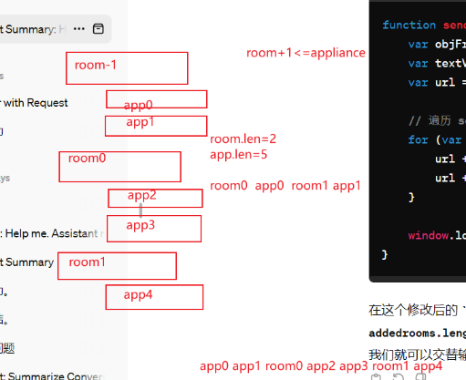

<<<<<<< HEAD
# OccupancyWatch-Toookit
A Few Shot Non Intrusive Load Monitoring website.
=======



```python
// 定义一个全局变量来存储 room 和其对应的 appliance
var roomApplianceData = [];

function addroom() {
    var dropdown2 = document.createElement('select');
    dropdown2.style.width = "35%";
    dropdown2.addEventListener('change', function() {
        var selectedRoom = dropdown1.options[dropdown1.selectedIndex].value;
        var selectedAppliance = dropdown2.options[dropdown2.selectedIndex].value;
        // 将选中的 room 和其对应的 appliance 添加到 roomApplianceData 数组中
        roomApplianceData.push({ room: selectedRoom, appliance: selectedAppliance });
        // 重新构建 URL
        buildUrl();
    });
    formfield.appendChild(dropdown2);
}

// 构建 URL 的函数
function buildUrl() {
    var objFrm = document.getElementById("field");
    var textVal = objFrm.querySelector("input[type='text']").value; // 获取输入的房间名
    var url = "?room=" + textVal;

    // 遍历 roomApplianceData 数组，依次取出每个 room 和其对应的 appliance，并添加到 URL 中
    roomApplianceData.forEach(function(data) {
        url += "&room=" + data.room + "&appliance=" + data.appliance;
    });

    // 重定向到新的 URL
    window.location.href = url;
}

```

```python
// 定义一个全局变量来存储每个房间及其对应的设备
var roomApplianceData = [];

// 添加设备到指定房间的函数
function addAppToRoom(roomIndex, appliance) {
    if (!roomApplianceData[roomIndex]) {
        roomApplianceData[roomIndex] = []; // 如果该房间尚未添加过任何设备，则创建一个空数组
    }
    roomApplianceData[roomIndex].push(appliance); // 将设备添加到该房间的数组中
}

// 构建 URL 的函数
function buildUrl() {
    var objFrm = document.getElementById("field");
    var textVal = objFrm.querySelector("input[type='text']").value; // 获取输入的房间名
    var url = "?room=" + textVal;

    // 遍历 roomApplianceData 数组，依次取出每个房间及其对应的设备，并添加到 URL 中
    roomApplianceData.forEach(function(appliances, index) {
        appliances.forEach(function(appliance) {
            url += "&room=" + index + "&appliance=" + appliance;
        });
    });

    // 重定向到新的 URL
    window.location.href = url;
}
// 添加房间的函数
function addroom() {
    // 此处省略添加房间的逻辑，假设用户输入的房间名存储在 textVal 变量中
    var textVal = ...; // 获取用户输入的房间名
    var roomIndex = roomApplianceData.length; // 每个新房间都有一个新的索引
    addAppToRoom(roomIndex, textVal); // 将房间添加到 roomApplianceData 数组中
}

// 添加设备到房间的函数
function addapp() {
    var dropdown2 = document.createElement('select');
    dropdown2.style.width = "35%";
    // 此处省略添加设备的逻辑，假设用户选择的设备存储在 selectedAppliance 变量中
    var selectedAppliance = ...; // 获取用户选择的设备
    var roomIndex = roomApplianceData.length - 1; // 获取最后一个添加的房间的索引
    addAppToRoom(roomIndex, selectedAppliance); // 将设备添加到相应的房间中
}

```

>>>>>>> 447af5c (更新了前端和后端)
